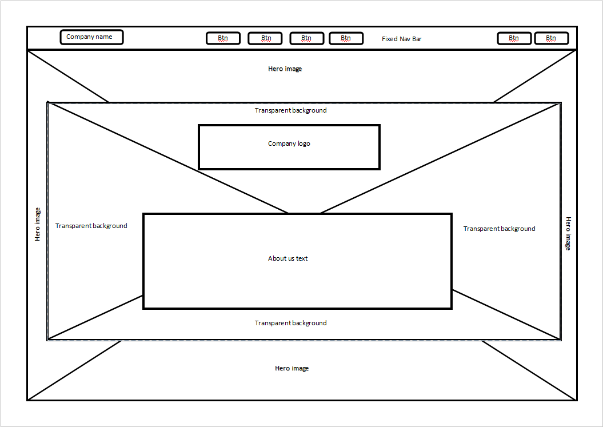
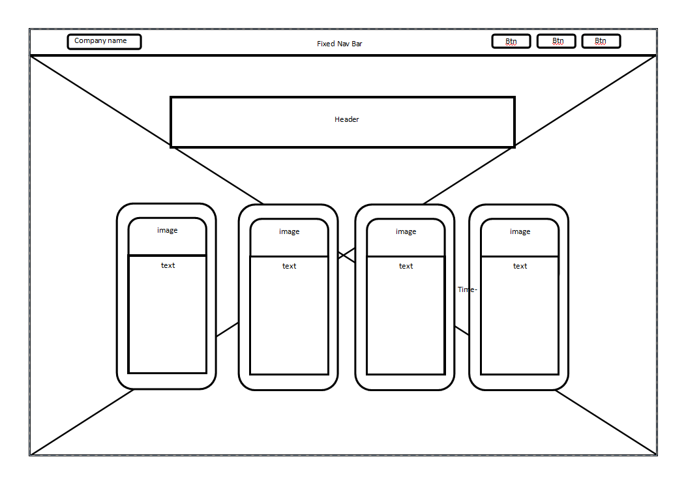
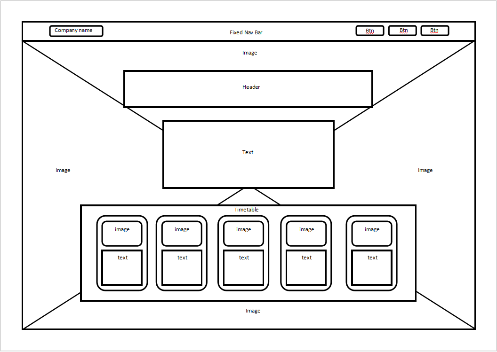
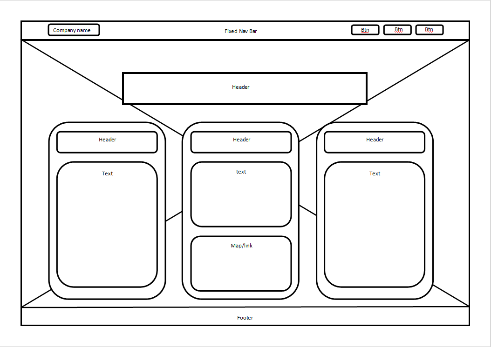

# milestone-project-1

## Table of Contents

1. Introduction
2. Project Goals
3. Website Structure and Design
   1. Design Choices
   2. WireFrames
4. Built With
5. Testing
6. License
7. Contact
8. Acknowledgements

## Introduction

This is a website for a company called New Forward Care as part of the Codeinstitute Milestone 1 Project.
they specilise in supporting adults with autism and mental health issues.

place holder images have been used in place of the real directors just for the purpose of this project.

## Project Goals

The goal of this project was to build a clear, informative, welcoming and easy to use platform that illustrates to the best of its ability the services offered by New Forward Care LTD, whilst also fulfilling all the criteria of the Code Institute Milestone 1 Project.

## Website Structure and Design

### Design Choices

I sat down with the company directors and we discussed the company and their needs in depth. Given the nature of their work it was clear they needed a simple, clear informative and welcoming website without overwhelming users with too much information at any one time.

I used this infomation to utilise my knowlege of design coupled with the psycology of color to come up with the following color pallet:

#d4f1f4
#75e6da
#189ab4
#05445e

I also decided on the use of carousels and cards. Both of these elements allow
you to display a lot of information in an easy to read, focused and interactive format. This allows users to browse each element at leasure taking away the daunting task of reading block text and giving them time to digest any information they read.

### WireFrames

Home page:

Meet Directors:

Events:

Contact Us:

## Built With

This website was built using HTML, CSS and Bootstrap componants in VS Code Editor.

## Testing

Guidelines for contributing to your project.

## License

Information about the project's license.

## Contact

Your contact information.

## Acknowledgements

Credit anyone whose code was used.
