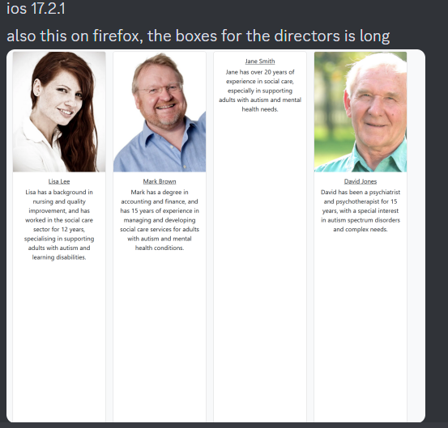

# milestone-project-1

## Table of Contents

1. Introduction
2. Project Goals
3. Deployment
4. Website Structure and Design
   1. Design Choices
   2. WireFrames
      1. Proposed Layout
      2. Revised Layout
5. Built With
6. Testing
   1. Manual
   2. Validation
   3. Live Testing
7. License
8. Contact
9. Acknowledgements

## Introduction

This is a website for a company called New Forward Care as part of the Codeinstitute Milestone 1 Project.
they specialise in supporting adults with autism and mental health issues.

Place holder images have been used in place of the real directors just for the purpose of this project.

## Project Goals

The goal of this project was to build a clear, informative, welcoming, responsive and easy to use platform that illustrates to the best of its ability the services offered by New Forward Care LTD, whilst also fulfilling all the criteria of the Code Institute Milestone 1 Project.

## Deployment

Find the full repo here:
<https://github.com/AlexanderMarriott/milestone-project-1>

Website has been deployed on github pages. Find it by copying this link into your navigation bar:
<https://alexandermarriott.github.io/milestone-project-1/>

find out how to deploy your own site to github pages by going to this address:
<https://docs.github.com/en/pages/getting-started-with-github-pages/creating-a-github-pages-site>

Details on how to fork this repository can be found here:
<https://docs.github.com/en/pull-requests/collaborating-with-pull-requests/working-with-forks/fork-a-repo>

## Website Structure and Design

### Design Choices

I sat down with the company directors and we discussed the company and their needs in depth. Given the nature of their work it was clear they needed a simple, clear informative and welcoming website without overwhelming users with too much information at any one time.

I used this infomation to utilise my knowledge of design coupled with the psychology of color to come up with the following color pallet:

- #d4f1f4
- #75e6da
- #189ab4
- #05445e

I also decided on the use of carousels and cards. Both of these elements allow
you to display a lot of information in an easy to read, focused and interactive format. This allows users to browse each element at leisure taking away the daunting task of reading block text and giving them time to digest any information they read.

the company opted not to link any of their social media to their website at this point whilst their pages are under revision.

### WireFrames

The proposed layouts were shown to the team at NFC before commencing with development.
they were happy with what was shown and so i commenced working on the project.

During development certain elements seemed busy or like they could be presented in a more accessible way. In these Scenarios revised Layouts were designed and sent over to the NFC team for approval.

Please find the proposed and revised Layouts below:

#### Proposed Layout

Home page proposed layout:

Meet Directors proposed layout:

Events proposed layout:

Contact Us proposed layout:

#### Revised Layout

navbar revised layout:

Events revised layout:

## Built With

This website was built using HTML, CSS and [Bootstrap](https://getbootstrap.com/) components in [VS Code Editor](https://code.visualstudio.com/).

Logo Creation was done via [Canva](https://www.canva.com/)

## Testing

### Maunual

Manual testing was performed by clicking each link and interaction and making sure each action behaved as designed and gave a response.
I then opened the site in dev tools and checked the design across multiple devices and screen sizes.

All tests showed the website was working as intended.

### Validation

The website has been ran through both validation services below.
A warning appears on the index.html file due to me using the logo as the header as opposed to a H1 element within the section. This was a design choice and was expected.

initial testing returned multiple trailing / on void element warnings. this was due to the use of prettier in vs code. i was able to disable this by adding the following code to the settings.json file:

"editor.formatOnSave": true,
"[html]": {
"editor.defaultFormatter": "vscode.html-language-features"
}

I found the solution at this web address:

<https://stackoverflow.com/questions/50261161/how-do-i-stop-prettier-from-formatting-html-files/56061737#56061737>

There was also some issues with duplicate code which arose from copy and pasting certain elements across all pages which was rectified by simply removing the duplicate code.

Please find the final results below:

<https://jigsaw.w3.org/css-validator/>

### Live testing

Initial testing was done via dev tools testing different devices and screen widths.
all tests returned working as intended.

Once i had launched the site on pages i checked to see how the website displayed on my i phone 13 pro max. The text for events wasn't remaining centre despite displaying correctly in dev tools. I then adjusted my css and added a media query to push the text to the right on mobile devices to keep them all uniform.

After finding the bug on my device i decided to reach out to a discord group to get as many devices and browsers looking at the site as possible so i could get live feedback and fix any bugs that may arise in real time. This can be seen below:

All bugs and errors that were found were fixed at the time of finding.

Jane smith was fixed by removing the external link and adding the image to assets.
The events issue was fixed by adjusting the pixels of the media query.
The extended column issue was fixed by assigning a fixed height to the card body.

If you notice any bugs that may have slipped through please raise an issue in the repo. you can learn how to do so by going here:

<https://docs.github.com/en/issues/tracking-your-work-with-issues/creating-an-issue>

#### Google lighthouse results

## Contact

Reach out to me at <alexmarriott590@gmail.com> for any enquiries about web design or having a site built for yourself.

## Acknowledgements

Template for carousels, Cards and navbar can be found at:
<https://getbootstrap.com/>
